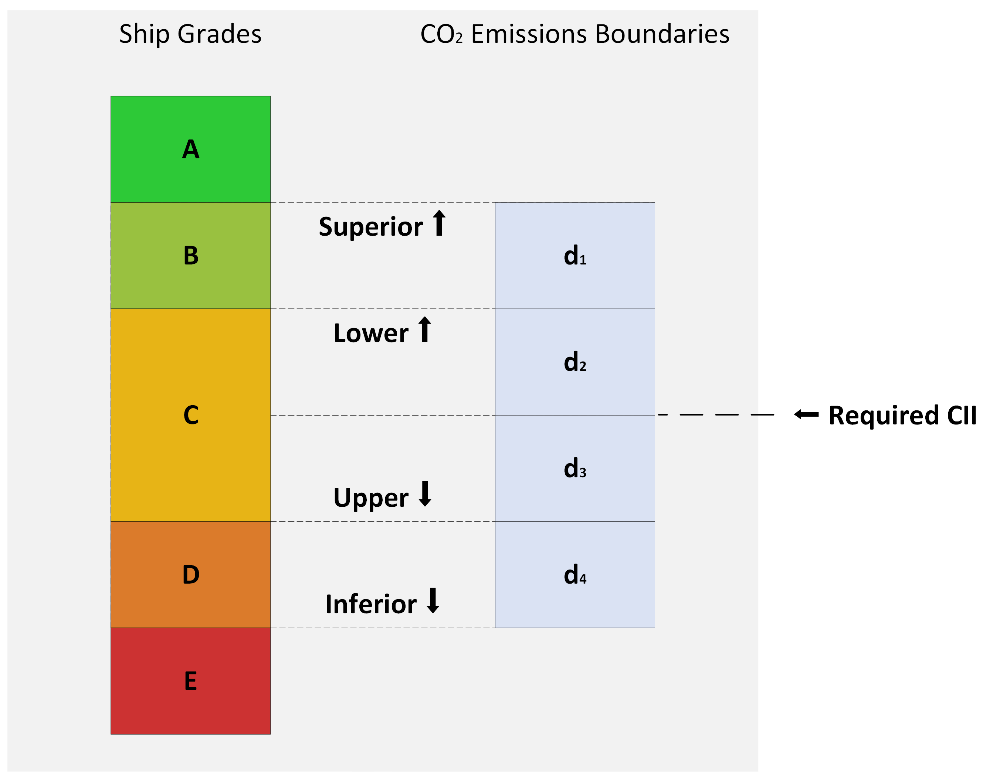

# Open IMO Carbon Intensity Indicator (CII) Calculator 🚢

## What is this?

An unofficial open source implementation of the International Maritime Organisation (IMO)'s Carbon Intensity Indicator (CII). 

The CII indicator aims to make the carbon intensity of any given ship easy to understand, transparent, and standardised. It does so by ranking all ships globally on an A to E rating (A being the best, E being the worst). Ship emission intensity calculations consider a mixture of weight, distance travelled in the calendar year, and the fuel used in their main engines (for a comprehensive explanation, see the [methodology section](#methodology)). 

Grades are re-calculated annually. The boundaries of what is considered "good" is a moving target, described in [table 4](#table-4-annual-carbon-reduction-factors-z). This moving target is intended to encourage shipping firms to constantly improve the carbon intensity of their ships to 2030.

The specification for this software can be found in [IMO's resolution MEPC.353(78)](https://wwwcdn.imo.org/localresources/en/KnowledgeCentre/IndexofIMOResolutions/MEPCDocuments/MEPC.353(78).pdf), adopted in June 2021. Additional references, summaries, & resolutions can be found in the [References \& datasets](#references--datasets) section.

# Table of Contents
- [Open IMO Carbon Intensity Indicator (CII) Calculator 🚢](#open-imo-carbon-intensity-indicator-cii-calculator-)
  - [What is this?](#what-is-this)
- [Table of Contents](#table-of-contents)
- [Methodology](#methodology)
  - [Ship Grade Ratio Methodology](#ship-grade-ratio-methodology)
    - [Ship Grade Worked example](#ship-grade-worked-example)
  - [Ship Attained Carbon Intensity Methodology](#ship-attained-carbon-intensity-methodology)
  - [Ship transport work methodology](#ship-transport-work-methodology)
  - [Ship CO2 Emissions Methodology](#ship-co2-emissions-methodology)
  - [Ship Capacity Methodology](#ship-capacity-methodology)
- [Reference Tables](#reference-tables)
  - [Table 1: MEPC.353(78) - Shipping Capacity Tables](#table-1-mepc35378---shipping-capacity-tables)
  - [Table 2: MEPC.364(79) Mass Conversion between fuel consumption and CO2 emissions](#table-2-mepc36479-mass-conversion-between-fuel-consumption-and-co2-emissions)
  - [Table 3: MEPC.339(76) - Ship Grading Boundaries](#table-3-mepc33976---ship-grading-boundaries)
  - [Table 4: Annual Carbon Reduction Factors (Z%)](#table-4-annual-carbon-reduction-factors-z)
  - [Table 5: Common shipping measurement conversions](#table-5-common-shipping-measurement-conversions)
- [Shipping Terminology \& Glossary](#shipping-terminology--glossary)
- [References \& datasets](#references--datasets)
  - [Further Reading](#further-reading)
  - [Useful datasets (mixed public and private)](#useful-datasets-mixed-public-and-private)

# Methodology

A ship's Carbon Intensity Indicator (CII) is measured by calculating its transport workload in a given calendar year, then calculating the mass of $CO_2$ produced by the ship in that year. The ship's *Attained CII* is the product of its $transportWork$ and the $massOfCO_2Emissions$ in one calendar year.

> $AttainedCII = massOfCo2Emissions \times transportWork$

Ships are split into 12 categories, for example "Bulk Carrier", "Tanker", "Cruise Passenger Ship" among others (see [Table 1](#table-1-mepc33776---shipping-capacity-tables) for a comprehensive list). A ship is compared internally among its category peers but never across categories, for example, a *Bulk Carrier* is not directly comparable to a *LNG Carrier* in this system.

**Inputs**
- The type of ship
- The type of fuel used by the ship's main engine 
- The capacity of the ship, measured in either Deadweight Tonnage (DWT) or Gross Tonnage (GT)
- The distance travelled by the ship in one calendar year, measured in nautical miles

The ship's *Attained CII* is then compared to its *Required CII* to produce an easy to understand grade for the ship. The grading scheme is in the range A to E, where A is the most efficient bracket, C represents a ship at-or-near its CII, and E is the least efficient. 

| Grade |  Description |
| ----- | ---- |
| A |   CII below the *Superior Boundary* |
| B |   CII above the *Superior Boundary* and below the *Lower Boundary* |
| C |   CII between the *Lower Boundary* and the *Upper Boundary* |
| D |   CII above the *Upper Boundary* and below the *Inferior Boundary* |
| E |   CII above the *Inferior Boundary* |

*Fig1.* IMO Boundaries, after [IMO MEPC.354(78)](https://wwwcdn.imo.org/localresources/en/KnowledgeCentre/IndexofIMOResolutions/MEPCDocuments/MEPC.354(78).pdf)

## Ship Grade Ratio Methodology

A ship's grade is calculated by comparing its ***Attained CII*** to its ***Required CII*** to give its performance $A/R$ ratio. If the ship's $A/R$ ratio falls below the boundary for its class of [Ship Type](#table-3-mepc33976---ship-grading-boundaries), it attains a higher (better) grade.  Boundaries are calculated as:

> $shipTypeRequiredCII \times exp(d_i)$. 

### Ship Grade Worked example
The worked example below considers a *Bulk Carrier*, with a Deadweight Tonnage below 279,000. Assuming the *Bulk Carrier*'s $required CII$ is:

> $10g CO_2 / DWT.NM$

> [!IMPORTANT]
For some ship types, $GT \times NM$ should be used instead of $DWT \times NM$, see [Table 1](#table-1-mepc33776---shipping-capacity-tables) and [transport work done methodology](#ship-transport-work-methodology) for a comprehensive guide. 

Then the boundaries are calculated with:
 
- $10 \times exp(d1)$
- $10 \times exp(d2)$
- $10 \times exp(d3)$
- $10 \times exp(d4)$. 

The $exp(d_i)$ rating boundaries for each ship type can be found in [Table 3](#table-3-mepc33976---ship-grading-boundaries). The resultant boundaries for the *Bulk Carrier* in question are:

| Boundary Type | Required CII | Boundary's Lower Threshold |
| ------------- | --------------- | --------------- |
| Superior      | $= 10 \times exp(d1)$   $= 10 \times 0.86$   $= 8.6$ |  $8.6 gCO_2/transportWork$ |
| Lower         | $= 10 \times exp(d2)$   $= 10 \times 0.94$   $= 9.4$ |  $9.4 gCO_2/transportWork$ |
| Upper         | $= 10 \times exp(d3)$   $= 10 \times 1.06$   $= 10.6$ | $10.6 gCO_2/transportWork$ |
| Inferior      | $= 10 \times exp(d4)$   $= 10 \times 1.18$   $= 11.8$ | $11.8 gCO_2/transportWork$ |

Grades are then derived from these boundaries, by comparing the ship's *Attained CII* to the thresholds across a given calendar year:

| Grade | Higher than | Lower than | Description |
| ----- | :----: | :----: | ---- |
| A |  | 8.6 | Below *Superior Boundary* |
| B |  8.6 | 9.4 | Above *Superior Boundary*, Below  *Lower Boundary* |
| C |  9.4 | 10.6 | Above *Lower Boundary*, Below  *Upper Boundary* |
| D |  10.6 | 11.8 | Above *Upper Boundary*, Below  *Inferior Boundary* |
| E |  11.8 | | Above *Inferior Boundary* |

**Example Results**:

- If the ship's *Attained CII* was $9gCO_2/ DWT \times NM$, the ship receives a grade `B`, as its *Attained CII* was above the threshold for *Superior Boundary*, but below the threshold for *Lower Boundary*.
- If the ship's *Attained CII* was $11gCO_2/ DWT \times NM$, the ship receives a grade `D`, as its *Attained CII* was above the threshold for *Upper Boundary*, but below the threshold for *Inferior Boundary*.

---

## Ship Attained Carbon Intensity Methodology

A ship's Attained carbon intensity is calculated by taking the [mass of its aggregate CO2 emissions](#ship-co_2-emissions-methodology) in a calendar year, and multiplying it by its [transport work done](#ship-transport-work-methodology) in the calendar year.

> $massOfCo2Emissions \times transportWork$

**Method accepts**:
- `massOfCo2Emissions`, the mass of $CO_2$ emissions in the calendar year 
    - See [co2 emissions methodology](#ship-co_2-emissions-methodology) to calculate
- `transportWork`, the work carried out by the ship in the calendar year
    - See [transport work methodology](#ship-transport-work-methodology) to calculate

**Method Returns**:
- A `double` representing the ship's *Attained Carbon Intensity*

**Implementation**:

Returns the product of a ship's mass of $CO_2$ emissions and its $transportWork$.

## Ship transport work methodology

A ship's transport work is calculated by taking its [capacity](#ship-capacity-methodology) and multiplying it by the distance sailed in nautical miles in the calendar year. 

> $capacity \times distanceSailed$

**Method accepts**:
- `capacity` the ship's capacity for cargo or passengers
    - See [ship capacity methodology](#ship-capacity-methodology) to calculate
-  `distanceSailed` the distance sailed in Nautical Miles in the calendar year

**Implementation**:

Returns the product of a ship's capacity and its distance sailed

## Ship CO2 Emissions Methodology

The sum of a ship's $CO_2$ emissions over a given year are calculated by multiplying the mass of consumed fuel by the fuel's emissions factor. 

**Method Accepts**:
- `fuelType`, an enum derrived from [Table 2](#table-2-mepc36479-mass-conversion-between-fuel-consumption-and-co_2-emissions)'s *Fuel Type* column
- `fuelConsumptionMass`, a `double` representing the mass of fuel consumed in grams (g) over the given year

**Method Returns**:

- A `double` representing the $M$ mass of $CO_2$ emitted by the ship across one calendar year

**Implementation**:

The sum of $CO_2$ emissions $M$ from fuel consumption in a given calendar year is 

> $M = FC_j \times C_{f_j}$

Where: 
- $j$ is the fuel type
- $FC_j$ is the mass in grams of the consumed fuel type `j` in one calendar year
- $C_{f_j}$ is the fuel oil mass to CO2 mass conversion factor, given in Table 2's $C_F$ column

## Ship Capacity Methodology

A ship's capacity is measured by either its Deadweight Tonnage (DWT) or Gross Tonnage (GT). The only exception is `Bulk Carriers`, which have a capacity capped at 279,000. 

To calculate a ship's Capacity in accordance with the IMO's MEPC353(78) guidelines:

**Method accepts**:
- `shipType`, an enum, derrived from *Table 1*'s *Ship Type* column
- `deadweightTonnage`, the *deadweight tonnage* of the ship, provided in long tons
- `grossTonnage`, the *gross tonnage* of the ship, provided in long tons

**Method returns**:
- a `double` representing the ship's capacity in imperial *long tons*

**Implementation**:

$Capacity$ of a given ship is calculated using the following rules:

- If the ship is a `Bulk Carrier`, and its DWT is 279,000 or above, its capacity is capped at 279,000
- If the ship is a `Bulk Carrier`, and its DWT is below 279,000, its capacity is equal to its DWT
- If the ship is a `Ro-ro cargo ship (vehicle carrier)`, a `Ro-ro passenger ship` or a `Cruise passenger ship`, its capacity is equal to its Gross Tonnage
- Otherwise, the ships capacity is equal to its DWT

The full implementation detail can be found in **[Table 1](#table-1-mepc33776-shipping-capacity)**'s *Ship Type*, *Ship weight*, and *Capacity* columns.

**Exceptions**:

- `ArgumentOutOfRangeException` is thrown if the DWT is set to 0, when ship type is set to anything other than `Ro-ro cargo ship (vehicle carrier)`, `Ro-ro passenger ship` or `Cruise passenger ship`
- `ArgumentOutOfRangeException` is thrown if the GT is set to 0, when ship type is set to `Ro-ro cargo ship (vehicle carrier)`, `Ro-ro passenger ship` or `Cruise passenger ship`

---

# Reference Tables

## Table 1: MEPC.353(78) - Shipping Capacity Tables

The following table describes how to determine a given ship type's *Capacity*.

*Table Source*: [IMO: MEPC.353(78)](https://wwwcdn.imo.org/localresources/en/KnowledgeCentre/IndexofIMOResolutions/MEPCDocuments/MEPC.353(78).pdf)

Ship Type               | Conditional Specification                     | Capacity     | $a$          | $c$
------------------------|-----------------------------|--------------|--------------|--------------
Bulk carrier            | 279,000 DWT and above                         | 279,000      | 4,745        | 0.622
Bulk carrier            | Less than 279,000 DWT                         | DWT          | 4,745        | 0.622
Gas carrier             | 65,000 and above                              | DWT          | 14405E7      | 2.071
Gas carrier             | Less than 65,000 DWT                          | DWT          | 8,104        | 0.639
Tanker                  |                                               | DWT          | 5,247        | 0.610
Container Ship          |                                               | DWT          | 1,984        | 0.489
General cargo ship      | 20,000 DWT and above                          | DWT          | 31,948       | 0.792
General cargo ship      | Less than 20,000 DWT                          | DWT          | 588          | 0.3885
Refrigerated cargo carrier|                                             | DWT          | 4,600        | 0.557
Combination carrier     |                                               | DWT          | 5,119        | 0.622
LNG Carrier             | 100,000 DWT and above                         | DWT          | 9.827        | 0.000
LNG Carrier             | 65,000 and above, less than 100,000           | DWT          | 14479E10     | 2.673
LNG Carrier             | less than 65,000 DWT                          | DWT          | 14779E10     | 2.673
Ro-ro cargo ship (vehicle carrier) | 57,700 and above                   | 57,000       | 3,627        | 0.590
Ro-ro cargo ship (vehicle carrier) | 30,000 and above, less than 57,700 | 3627         | 5,739        | 0.590
Ro-ro cargo ship (vehicle carrier) | less than 30,000                   | GT           | 330          | 0.329
Ro-ro cargo ship         |                                              | GT           | 1,967        | 0.485
Ro-ro passenger ship     | Ro-ro passenger ship                         | GT           | 2,023        | 0.460
Ro-ro passenger ship     | High-speed craft designed to SOLAS chapter X | GT           | 4,196        | 0.460
Cruise passenger ship    |                                              | GT           | 930          | 0.383

---

## Table 2: MEPC.364(79) Mass Conversion between fuel consumption and CO2 emissions

The following table describes how to convert from the fuel used by a ship's main engine $ME_{(i)}$ to the amount of $CO_2$ produced. Fuel consumption is measured in grams (g), as is the output $CO_2$ emission

*Table source*: [IMO: MEPC.364(79)](https://wwwcdn.imo.org/localresources/en/KnowledgeCentre/IndexofIMOResolutions/MEPCDocuments/MEPC.364(79).pdf)

| ID | Fuel Type            | Source/Reference          | Carbon Content | $C_F (\frac{t-CO_2}{t-Fuel})$ | Lower calorific value (kJ/kg) |
|----|----------------------|---------------------------|----------------|--------------------------------|--------------------------------|
| 1  | Diesel / Gas Oil     | ISO 8217 Grade DMX to DMB |           0.8744 |                          3.206 |                         42,700 |
| 2  | Light Fuel Oil (LFO) | ISO 8217 Grade RMA to RMD |           0.8594 |                          3.151 |                         41,200 |
| 3  | Heavy Fuel Oil (HFO) | ISO 8217 Grade RME to RMK |           0.8493 |                          3.114 |                         40,200 |
| 4a | Liquified Petroleum (Propane) | Propane          |           0.8182 |                          3.000 |                         46,300 |
| 4b | Liquified Petroleum (Butane)  | Butane           |           0.8264 |                          3.030 |                         45,700 |
| 5  | Ethane               | -                         |           0.7989 |                          2.927 |                         46,400 |
| 6  | Liquified Natural Gas (LNG)   | n/a              |           0.7500 |                          2.750 |                         48,000 |
| 7  | Methanol             | n/a                       |           0.3750 |                          1.375 |                         19,900 |
| 8  | Ethanol              | n/a                       |           0.5217 |                          1.913 |                         26,800 |

---

## Table 3: MEPC.339(76) - Ship Grading Boundaries

The following table describes the $dd$ vectors used to determine the rating boundaries for ship types. The columns $dd$ $exp(d_i)$ values represent the boundaries the IMO's rating system in the baseline year (2019). 

*Table source (2022)*: [IMO: MEPC.354(78)](https://wwwcdn.imo.org/localresources/en/KnowledgeCentre/IndexofIMOResolutions/MEPCDocuments/MEPC.354(78).pdf)
*Previous source (2021)*: [IMO: MEPC.339(76)](https://wwwcdn.imo.org/localresources/en/OurWork/Environment/Documents/Air%20pollution/MEPC.339(76).pdf)

| Id | Ship Type | Weight Classification | Capacity in CII Calculation | *dd* vector exp(d1) | *dd* vector exp(d2) | *dd* vector exp(d3) | *dd* vector exp(d4) | 
| ----------- | ----------- | ----------- | ----------- | ----------: | ----------: | ----------: | ----------: |
| 1 | Bulk Carrier                          |                           | DWT | 0.86 | 0.94 | 1.06 | 1.18 |
| 2.a | Gas Carrier                         | 65,000 DWT and above      | DWT | 0.81 | 0.91 | 1.12 | 1.44 |
| 2.b | Gas Carrier                         | Less than 65,000 DWT      | DWT | 0.85 | 0.95 | 1.06 | 1.25 |
| 3 | Tanker                                |                           | DWT | 0.82 | 0.93 | 1.08 | 1.28 |
| 4 | Container Ship                        |                           | DWT | 0.83 | 0.94 | 1.07 | 1.19 |
| 5 | General Cargo Ship                    |                           | DWT | 0.83 | 0.94 | 1.06 | 1.19 |
| 6 | Refrigerated Cargo Carrier            |                           | DWT | 0.78 | 0.91 | 1.07 | 1.20 |
| 7 | Combination Carrier                   |                           | DWT | 0.87 | 0.96 | 1.06 | 1.14 |
| 8.a | LNG Carrier                         | 100,000 DWT and above     | DWT | 0.89 | 0.98 | 1.06 | 1.13 |
| 8.b | LNG Carrier                         | Less than 100,000 DWT     | DWT | 0.78 | 0.92 | 1.10 | 1.37 |
| 9 | Ro-ro Cargo Ship (Vehicle Carrier)    |                           | GT  | 0.86 | 0.94 | 1.06 | 1.16 |
| 10 | Ro-ro Cargo Ship                     |                           | GT  | 0.76 | 0.89 | 1.08 | 1.27 |
| 11 | Ro-ro Passenger Ship                 |                           | GT  | 0.76 | 0.92 | 1.14 | 1.30 |
| 12 | Cruise Passenger Ship                |                           | GT  | 0.87 | 0.95 | 1.06 | 1.16 |

---

## Table 4: Annual Carbon Reduction Factors (Z%)

The following table describes the reduction factor to be applied to a ship's $requiredCII$ on an annual basis. IMO have 
to date released figures up to 2026. In the table, the values from 2027 onwards are **unofficial estimates** based on the pattern to 2026. IMO aims to release
new reduction factors

*Table Source*: [IMO: MEPC.338(76)](https://wwwcdn.imo.org/localresources/en/OurWork/Environment/Documents/Air%20pollution/MEPC.338(76).pdf)

| Year | Reduction factor  Relative to 2019 | Estimated Reduction Factor |
| ---- | -----: | ---: |
| 2019 | 0%     | -- % |
| 2020 | 1%     | -- % |
| 2021 | 2%     | -- % |
| 2022 | 3%     | -- % |
| 2023 | 5%     | -- % |
| 2024 | 7%     | -- % |
| 2025 | 9%     | -- % |
| 2026 | 11%    | -- % |
| 2027 | -- %   | 13%  |
| 2028 | -- %   | 15%  |
| 2029 | -- %   | 17%  |
| 2030 | -- %   | 19%  |

---

## Table 5: Common shipping measurement conversions

Often in shipping, non-metric measurements are used. Conversions are detailed below

| Measure | Metric Measure | Notes |
| ------------- | ------------- | ------------- |
| Deadweight Tonne (DWT) | $1016.0469088kg$ | DWT is a ship's total weight excluding boiler water, measured in Imperial long tons |
| Gross Tonne (GT) | $1016.0469088kg$ | GT is a ship's area, measured in Imperial long tons |
| Nautical Mile (NM) | $1.852km$, $1,852m$ | NM is equal to 1 minute of latitude at the equator. $1NM = 1.5078 miles = 1.852km$ |

---

# Shipping Terminology & Glossary

| Term | Description | Notes |
| ------------- | ------------- | ------------- |
| Carbon Dioxide Equivalent (CO2eq, CO2, CO2e, $CO_2$) | A ship's carbon dioxide emissions | Expressed in this implementation in grams (metric) |
| Carbon Intensity Index (CII) | The relative measure of a ship's carbon dioxide emissions, taking distance travelled and fuel type used into account |  |
| Deadweight Tonnage (DWT) | The measure of a the total contents of a ship, including cargo, fuel, crew, passengers, and water (Excludes water in a ship's boiler) | Expressed in long tons (British Imperial) |
| Final Draft International Standard (FDIS) | A draft status for an ISO Standard, indicating the standard is in its final stage of approval |  |
| Gross Tonnage (GT) | A ship's internal volume | Expressed in long tons (British Imperial) |
| International Maritime Organisation (IMO) | A UN Agency responsible for regulating maritime transport rules & regulations |  |
| International Organization for Standardization (ISO) | Independent, non-governmental, international standard development organization |  |
| Liquefied natural gas (LNG) | Gas, compressed into liquid form for easier transport |  |
| Nautical Miles (NM, nmile) | Distance travelled over water, different to land measured miles (statute miles) | Expressed in minutes of latitude at the equator |
| Resolution MEPC.353(78) | Internationally standardised reference guide to shipping carbon intensity |  |
| Roll-on-roll-off (Ro-ro, Roro, Ro ro) | A ship designed to take cargo which can be wheeled (or rolled) in and out of a cargo hold |  |

# References & datasets

- IMO: MEPC.337(76) - Carbon Intensity Index (CII) spec: https://wwwcdn.imo.org/localresources/en/KnowledgeCentre/IndexofIMOResolutions/MEPCDocuments/MEPC.337(76).pdf
- IMO: MEPC.364(79) - Energy Efficiency Design Index (EEDI) spec: https://wwwcdn.imo.org/localresources/en/KnowledgeCentre/IndexofIMOResolutions/MEPCDocuments/MEPC.364(79).pdf
- IMO: MEPC.339(76) - 2021 Guidelines on the operational carbon intensity rating of ships (CII Rating Guidelines, G4): https://wwwcdn.imo.org/localresources/en/OurWork/Environment/Documents/Air%20pollution/MEPC.339(76).pdf
- IMO: MEPC.339(76) - 2022 Guidelines on the operational carbon intensity rating of ships (CII Rating Guidelines, G4): https://wwwcdn.imo.org/localresources/en/KnowledgeCentre/IndexofIMOResolutions/MEPCDocuments/MEPC.354(78).pdf
- ISO 8217:2017 (Current standard) - Petroleum products, Fuels (class F), Specifications of marine fuels: https://www.iso.org/standard/64247.html
- ISO/FDIS 8217 (Standard under development) - Products from petroleum, synthetic and renewable sources, Fuels (class F), Specifications of marine fuel: https://www.iso.org/standard/80579.html

## Further Reading

- IMO's press briefing, including links to the comprehensive guidelines: https://www.imo.org/en/MediaCentre/PressBriefings/pages/CII-and-EEXI-entry-into-force.aspx
- Society of Naval Architecture Students summary of CII Calculations: https://github.com/snascusat/CII-Calculator
- DNV's summary of EEXI and CII requirements: https://www.dnv.com/news/eexi-and-cii-requirements-taking-effect-from-1-january-2023-237817/

## Useful datasets (mixed public and private)

- UNStats (public, non-commercial dataset): https://unstats.un.org/bigdata/task-teams/ttt-dashboards/
- Dataliastic (private commercial dataset): https://datalastic.com/pricing/
- Marine Traffic (private commercial dataset): https://servicedocs.marinetraffic.com/ 
