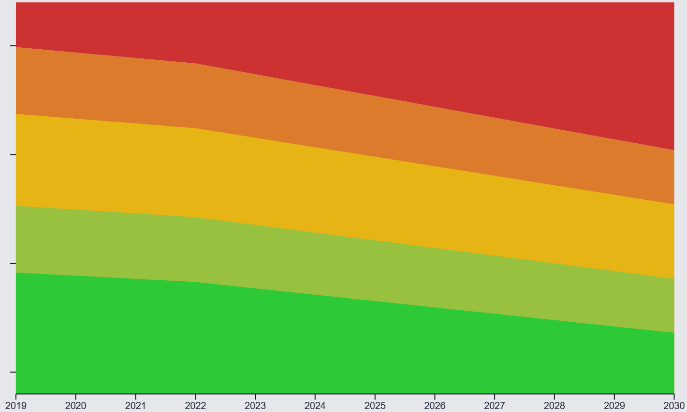

# Open _IMO Carbon Intensity Indicator (CII)_ Calculator (Python) 🚢

### Other versions

[A C# version is available here](../README.md)

## What is this?

An unofficial open source implementation of the International Maritime Organisation (IMO)'s Carbon Intensity Indicator (CII).

The CII indicator aims to make the carbon intensity of any given ship easy to understand, transparent, and standardised. It does so by ranking all ships globally on an A to E rating (A being the best, E being the worst). Ship emission intensity calculations consider a mixture of weight, distance travelled in the calendar year, and the fuel used in their main engines (for a comprehensive explanation, see the [methodology section](#methodology)).


Grades are re-calculated annually. The boundaries of what is considered "good" is a moving target, described in [table 4](#table-4-annual-carbon-reduction-factors-z). This moving target is intended to encourage shipping firms to constantly improve the carbon intensity of their ships to 2030. The graph below demonstrates the gradual tightening of the IMO's Carbon Intensity requirements over time. The nearer to 2030, the lower a ship's Attained CII must be to achieve an A grade.



The specification for this software can be found in [IMO's resolution MEPC.354(78)](https://wwwcdn.imo.org/localresources/en/KnowledgeCentre/IndexofIMOResolutions/MEPCDocuments/MEPC.354(78).pdf), adopted in June 2022. Additional references, summaries, & resolutions can be found in the [References & datasets](#references--datasets) section.

> **NOTE**
> The repository code & software is provided as-is. While best-efforts are made to ensure its results are accurate inline with the IMO's CII specifications, the results it produces are _**estimates**_ and _**guidance**_. Results should not be considered proof of regulatory compliance.

# Table of Contents
- [Open IMO Carbon Intensity Indicator (CII) Calculator 🚢](#open-imo-carbon-intensity-indicator-cii-calculator-)
  - [What is this?](#what-is-this)
- [Table of Contents](#table-of-contents)
- [Software](#software)
  - [Software Roadmap](#software-roadmap)
  - [Getting Started](#getting-started)
    - [Calculator Result Format](#calculator-result-format)
- [Methodology](#methodology)
  - [Ship Grade Ratio Methodology](#ship-grade-ratio-methodology)
    - [Ship Grade Worked example](#ship-grade-worked-example)
  - [Ship Attained Carbon Intensity Methodology](#ship-attained-carbon-intensity-methodology)
  - [Ship transport work methodology](#ship-transport-work-methodology)
  - [Ship CO2 Emissions Methodology](#ship-co2-emissions-methodology)
  - [Ship Capacity Methodology](#ship-capacity-methodology)
- [Reference Tables](#reference-tables)
  - [Table 1: MEPC.353(78) - Shipping Capacity Tables](#table-1-mepc35378---shipping-capacity-tables)
  - [Table 2: MEPC.364(79) Mass Conversion between fuel consumption and CO2 emissions](#table-2-mepc36479-mass-conversion-between-fuel-consumption-and-co2-emissions)
  - [Table 3: MEPC.339(76) - Ship Grading Boundaries](#table-3-mepc33976---ship-grading-boundaries)
  - [Table 4: Annual Carbon Reduction Factors (Z%)](#table-4-annual-carbon-reduction-factors-z)
  - [Table 5: Common shipping measurement conversions](#table-5-common-shipping-measurement-conversions)
- [Shipping Terminology & Glossary](#shipping-terminology--glossary)
- [References & datasets](#references--datasets)
  - [Further Reading](#further-reading)
  - [Useful datasets (mixed public and private)](#useful-datasets-mixed-public-and-private)

# Software

## Software Roadmap

The following features are on the roadmap for the application:

- Support for Dependency Injection (DI). Currently the application does not
- Support for IMO Resolution MEPC.355(78). Currently the application considers fuel consumption only. Support for MEPC355(78) will bring additional CII properties, for example the lighting in crew quarters.

## Getting Started

The library can be installed as a Python package (coming soon). There is a Python module at `open_imo_cii_calculator/ship_carbon_intensity_calculator.py`, which demonstrates how to create a new instance of the calculator, submit data, and receive results in the format `CalculationResult`.

When submitting data to the `calculate_attained_cii_rating` method, the following parameters are required:

```python
ShipType ship_type,
float gross_tonnage,
float deadweight_tonnage,
float distance_travelled,
Iterable[FuelTypeConsumption] fuel_type_consumptions,
int target_year
```

- The ship's type must be one of `ShipType` (see `open_imo_cii_calculator/models/ship_type.py`).
- Gross Tonnage is measured in [long-tons](https://en.wikipedia.org/wiki/Long_ton) (1.016047 metric tonnes, or 1,016.047 kilograms)
- Deadweight Tonnage is measured in [long-tons](https://en.wikipedia.org/wiki/Long_ton) (1.016047 metric tonnes, or 1,016.047 kilograms)
- Distance travelled is measured in [nautical miles](https://en.wikipedia.org/wiki/Nautical_mile) (1,852 metres)
- Fuel type must be one of `TypeOfFuel` (see `open_imo_cii_calculator/models/fuel_type.py`)
- Fuel consumption is measured in grams, and accepts scientific notation like `1.9e+10`
- Year must refer to the measured year. For example, if a ship's fuel consumption is known in 2022, all other results will be based from that point

**_Multiple Fuel Type calculations_**

There is a `calculate_attained_cii_rating` method for ships which consume multiple fuel types. Pass a list of `FuelTypeConsumption` objects to the method.

### Calculator Result Format

The result is a `CalculationResult` object containing a list of `ResultYear` objects, each with the following properties:

- `is_measured_year`: describes if the result array was generated based on this year
- `is_estimated_year`: describes if the result array was NOT generated based on this year (is always equal to not is_measured_year)
- `year`: describes the year in question
- `rating`: describes the rating for the ship in the given year. A=1, B=2, C=3, D=4, E=5. 0 indicates an error. See `ImoCiiRating` in `open_imo_cii_calculator/models/imo_cii_rating.py`
- `required_cii`: The actual intensity required for the ship to be considered in-range of the IMO's regulations (note that from 2027 onwards, this is a projection)
- `attained_cii`: The estimated or actual intensity attained for the ship in the given year
- `attained_required_ratio`: The ratio between `required_cii` and `attained_cii`
- `calculated_co2e_emissions`: The calculated CO2e emissions this result was based on
- `calculated_ship_capacity`: The calculated ship capacity this result was based on
- `calculated_transport_work`: The calculated transport work this result was based on
- `vector_boundaries_for_year`: An object with the following properties:
  - `year`: the year in question
  - `ship_type`: the type of ship (`ShipType`)
  - `weight_classification`: the weight classification the ship has been considered for
  - `capacity_unit`: describes if this ship was measured against its Deadweight or Gross Tonnage (`CapacityUnit`)
  - `boundary_dd_vectors`: a dictionary with keys `SUPERIOR`, `LOWER`, `UPPER`, `INFERIOR` (see `ImoCiiBoundary`)

# Methodology

A ship's Carbon Intensity Indicator (CII) is measured by calculating its transport workload in a given calendar year, then calculating the mass of $CO_2$ produced by the ship in that year. The ship's *Attained CII* is the product of its $transportWork$ and the $massOfCO_2Emissions$ in one calendar year.

> $AttainedCII = massOfCo2Emissions / transportWork$

Ships are split into 12 categories, for example "Bulk Carrier", "Tanker", "Cruise Passenger Ship" among others (see [Table 1](#table-1-mepc35378---shipping-capacity-tables) for a comprehensive list). A ship is compared internally among its category peers but never across categories, for example, a *Bulk Carrier* is not directly comparable to a *LNG Carrier* in this system.

**Inputs**
- The type of ship
- The type of fuel used by the ship's main engine
- The capacity of the ship, measured in either Deadweight Tonnage (DWT) or Gross Tonnage (GT)
- The distance travelled by the ship in one calendar year, measured in nautical miles

The ship's *Attained CII* is then compared to its *Required CII* to produce an easy to understand grade for the ship. The grading scheme is in the range A to E, where A is the most efficient bracket, C represents a ship at-or-near its CII, and E is the least efficient.

| Grade |  Description |
| ----- | ---- |
| A |   CII below the *Superior Boundary* |
| B |   CII above the *Superior Boundary* and below the *Lower Boundary* |
| C |   CII between the *Lower Boundary* and the *Upper Boundary* |
| D |   CII above the *Upper Boundary* and below the *Inferior Boundary* |
| E |   CII above the *Inferior Boundary* |


*Fig1.* IMO Boundaries, after [IMO MEPC.354(78)](https://wwwcdn.imo.org/localresources/en/KnowledgeCentre/IndexofIMOResolutions/MEPCDocuments/MEPC.354(78).pdf)

## Ship Grade Ratio Methodology

A ship's grade is calculated by comparing its ***Attained CII*** to its ***Required CII*** to give its performance $A/R$ ratio. If the ship's $A/R$ ratio falls below the boundary for its class of [Ship Type](#table-3-mepc33976---ship-grading-boundaries), it attains a higher (better) grade.  Boundaries are calculated as:

> $shipTypeRequiredCII \times exp(d_i)$.

### Ship Grade Worked example
The worked example below considers a *Bulk Carrier*, with a Deadweight Tonnage below 279,000. Assuming the *Bulk Carrier*'s $required CII$ is:

> $10g CO_2 / DWT.NM$

> **IMPORTANT**
> For some ship types, $GT \times NM$ should be used instead of $DWT \times NM$, see [Table 1](#table-1-mepc35378---shipping-capacity-tables) and [transport work done methodology](#ship-transport-work-methodology) for a comprehensive guide.

Then the boundaries are calculated with:

- $10 \times exp(d1)$
- $10 \times exp(d2)$
- $10 \times exp(d3)$
- $10 \times exp(d4)$.

The $exp(d_i)$ rating boundaries for each ship type can be found in [Table 3](#table-3-mepc33976---ship-grading-boundaries). The resultant boundaries for the *Bulk Carrier* in question are:

| Boundary Type | Required CII | Boundary's Lower Threshold |
| ------------- | --------------- | --------------- |
| Superior      | $= 10 \times exp(d1)$ <br /> $= 10 \times 0.86$<br />  $= 8.6$ |  $8.6 gCO_2/transportWork$ |
| Lower         | $= 10 \times exp(d2)$ <br /> $= 10 \times 0.94$<br />  $= 9.4$ |  $9.4 gCO_2/transportWork$ |
| Upper         | $= 10 \times exp(d3)$ <br /> $= 10 \times 1.06$<br />  $= 10.6$ | $10.6 gCO_2/transportWork$ |
| Inferior      | $= 10 \times exp(d4)$ <br /> $= 10 \times 1.18$<br />  $= 11.8$ | $11.8 gCO_2/transportWork$ |

Grades are then derived from these boundaries, by comparing the ship's *Attained CII* to the thresholds across a given calendar year:

| Grade | Higher than | Lower than | Description |
| ----- | :----: | :----: | ---- |
| A |  | 8.6 | Below *Superior Boundary* |
| B |  8.6 | 9.4 | Above *Superior Boundary*,<br />Below  *Lower Boundary* |
| C |  9.4 | 10.6 | Above *Lower Boundary*,<br />Below  *Upper Boundary* |
| D |  10.6 | 11.8 | Above *Upper Boundary*,<br />Below  *Inferior Boundary* |
| E |  11.8 | | Above *Inferior Boundary* |

**Example Results**:

- If the ship's *Attained CII* was $9gCO_2/ DWT \times NM$, the ship receives a grade `B`, as its *Attained CII* was above the threshold for *Superior Boundary*, but below the threshold for *Lower Boundary*.
- If the ship's *Attained CII* was $11gCO_2/ DWT \times NM$, the ship receives a grade `D`, as its *Attained CII* was above the threshold for *Upper Boundary*, but below the threshold for *Inferior Boundary*.

---

## Ship Attained Carbon Intensity Methodology

A ship's Attained carbon intensity is calculated by taking the [mass of its aggregate CO<sub>2</sub> emissions](#ship-co2-emissions-methodology) in a calendar year, and dividing it by its [transport work done](#ship-transport-work-methodology) in the calendar year.

> $AttainedCII = massOfCo2Emissions / transportWork$

**Method accepts**:
- `mass_of_co2_emissions`, the mass of $CO_2$ emissions in the calendar year
    - See [co2 emissions methodology](#ship-co2-emissions-methodology) to calculate
- `transport_work`, the work carried out by the ship in the calendar year
    - See [transport work methodology](#ship-transport-work-methodology) to calculate

**Method Returns**:
- A `float` representing the ship's *Attained Carbon Intensity*

**Implementation**:

Returns the quotient of a ship's mass of $CO_2$ emissions and its $transportWork$.

## Ship transport work methodology

A ship's transport work is calculated by taking its [capacity](#ship-capacity-methodology) and multiplying it by the distance sailed in nautical miles in the calendar year.

> $capacity \times distanceSailed$

**Method accepts**:
- `capacity` the ship's capacity for cargo or passengers
    - See [ship capacity methodology](#ship-capacity-methodology) to calculate
-  `distance_sailed` the distance sailed in Nautical Miles in the calendar year

**Implementation**:

Returns the product of a ship's capacity and its distance sailed

## Ship CO<sub>2</sub> Emissions Methodology

The sum of a ship's $CO_2$ emissions over a given year are calculated by multiplying the mass of consumed fuel by the fuel's emissions factor. If the ship consumes multiple fuel types, the calculation is repeated for each fuel type & consumption mass, then those results are summed together.

**Method Accepts**:
- `fuel_type`, an enum derived from [Table 2](#table-2-mepc36479-mass-conversion-between-fuel-consumption-and-co2-emissions)'s *Fuel Type* column
- `fuel_consumption_mass`, a `float` representing the mass of fuel consumed in grams (g) over the given year

**Method Returns**:
- A `float` representing the $M$ mass of $CO_2$ emitted by the ship across one calendar year

**Implementation**:

The sum of $CO_2$ emissions $M$ from fuel consumption in a given calendar year is

> $M = FC_j \times C_{{f_j}}$

Where:
- $j$ is the fuel type
- $FC_j$ is the mass in grams of the consumed fuel type `j` in one calendar year
- $C_{{f_j}}$ is the fuel oil mass to CO2 mass conversion factor, given in Table 2's $C_F$ column

## Ship Capacity Methodology

A ship's capacity is measured by either its Deadweight Tonnage (DWT) or Gross Tonnage (GT). The only exception is `Bulk Carriers`, which have a capacity capped at 279,000.

To calculate a ship's Capacity in accordance with the IMO's MEPC353(78) guidelines:

**Method accepts**:
- `ship_type`, an enum, derived from *Table 1*'s *Ship Type* column
- `deadweight_tonnage`, the *deadweight tonnage* of the ship, provided in long tons
- `gross_tonnage`, the *gross tonnage* of the ship, provided in long tons

**Method returns**:
- a `float` representing the ship's capacity in imperial *long tons*

**Implementation**:

$Capacity$ of a given ship is calculated using the following rules:

- If the ship is a `Bulk Carrier`, and its DWT is 279,000 or above, its capacity is capped at 279,000
- If the ship is a `Bulk Carrier`, and its DWT is below 279,000, its capacity is equal to its DWT
- If the ship is a `Ro-ro cargo ship (vehicle carrier)`, a `Ro-ro passenger ship` or a `Cruise passenger ship`, its capacity is equal to its Gross Tonnage
- Otherwise, the ships capacity is equal to its DWT

The full implementation detail can be found in **[Table 1](#table-1-mepc35378---shipping-capacity-tables)**'s *Ship Type*, *Ship weight*, and *Capacity* columns.

**Exceptions**:

- `ValueError` is raised if the DWT is set to 0, when ship type is set to anything other than `Ro-ro cargo ship (vehicle carrier)`, `Ro-ro passenger ship` or `Cruise passenger ship`
- `ValueError` is raised if the GT is set to 0, when ship type is set to `Ro-ro cargo ship (vehicle carrier)`, `Ro-ro passenger ship` or `Cruise passenger ship`

---

# Reference Tables

## Table 1: MEPC.353(78) - Shipping Capacity Tables

The following table describes how to determine a given ship type's *Capacity*.

*Table Source*: [IMO: MEPC.353(78)](https://wwwcdn.imo.org/localresources/en/KnowledgeCentre/IndexofIMOResolutions/MEPCDocuments/MEPC.353(78).pdf)

_Same as C# version, see root README for table._

---

## Table 2: MEPC.364(79) Mass Conversion between fuel consumption and CO<sub>2</sub> emissions

The following table describes how to convert from the fuel used by a ship's main engine $ME_{{(i)}}$ to the amount of $CO_2$ produced. Fuel consumption is measured in grams (g), as is the output $CO_2$ emission

*Table source*: [IMO: MEPC.364(79)](https://wwwcdn.imo.org/localresources/en/KnowledgeCentre/IndexofIMOResolutions/MEPCDocuments/MEPC.364(79).pdf)

_Same as C# version, see root README for table._

---

## Table 3: MEPC.339(76) - Ship Grading Boundaries

The following table describes the $dd$ vectors used to determine the rating boundaries for ship types. The columns $dd$ $exp(d_i)$ values represent the boundaries the IMO's rating system in the baseline year (2019).

*Table source (2022)*: [IMO: MEPC.354(78)](https://wwwcdn.imo.org/localresources/en/KnowledgeCentre/IndexofIMOResolutions/MEPCDocuments/MEPC.354(78).pdf)
*Previous source (2021)*: [IMO: MEPC.339(76)](https://wwwcdn.imo.org/localresources/en/OurWork/Environment/Documents/Air%20pollution/MEPC.339(76).pdf)

_Same as C# version, see root README for table._

---

## Table 4: Annual Carbon Reduction Factors (Z%)

The following table describes the reduction factor to be applied to a ship's $requiredCII$ on an annual basis. IMO have
to date released figures up to 2026. In the table, the values from 2027 onwards are **unofficial estimates** based on the pattern to 2026. IMO aims to release
new reduction factors

*Table Source*: [IMO: MEPC.338(76)](https://wwwcdn.imo.org/localresources/en/OurWork/Environment/Documents/Air%20pollution/MEPC.338(76).pdf)

_Same as C# version, see root README for table._

---

## Table 5: Common shipping measurement conversions

Often in shipping, non-metric measurements are used. Conversions are detailed below

_Same as C# version, see root README for table._

---

# Shipping Terminology & Glossary

_Same as C# version, see root README for table._

# References & datasets

- IMO: MEPC.337(76) - Carbon Intensity Index (CII) spec: https://wwwcdn.imo.org/localresources/en/KnowledgeCentre/IndexofIMOResolutions/MEPCDocuments/MEPC.337(76).pdf
- IMO: MEPC.364(79) - Energy Efficiency Design Index (EEDI) spec: https://wwwcdn.imo.org/localresources/en/KnowledgeCentre/IndexofIMOResolutions/MEPCDocuments/MEPC.364(79).pdf
- IMO: MEPC.339(76) - 2021 Guidelines on the operational carbon intensity rating of ships (CII Rating Guidelines, G4): https://wwwcdn.imo.org/localresources/en/OurWork/Environment/Documents/Air%20pollution/MEPC.339(76).pdf
- IMO: MEPC.339(76) - 2022 Guidelines on the operational carbon intensity rating of ships (CII Rating Guidelines, G4): https://wwwcdn.imo.org/localresources/en/KnowledgeCentre/IndexofIMOResolutions/MEPCDocuments/MEPC.354(78).pdf
- ISO 8217:2017 (Current standard) - Petroleum products, Fuels (class F), Specifications of marine fuels: https://www.iso.org/standard/64247.html
- ISO/FDIS 8217 (Standard under development) - Products from petroleum, synthetic and renewable sources, Fuels (class F), Specifications of marine fuel: https://www.iso.org/standard/80579.html

## Further Reading

- IMO's press briefing, including links to the comprehensive guidelines: https://www.imo.org/en/MediaCentre/PressBriefings/pages/CII-and-EEXI-entry-into-force.aspx
- Society of Naval Architecture Students summary of CII Calculations: https://github.com/snascusat/CII-Calculator
- DNV's summary of EEXI and CII requirements: https://www.dnv.com/news/eexi-and-cii-requirements-taking-effect-from-1-january-2023-237817/

## Useful datasets (mixed public and private)

- UNStats (public, non-commercial dataset): https://unstats.un.org/bigdata/task-teams/ttt-dashboards/
- Dataliastic (private commercial dataset): https://datalastic.com/pricing/
- Marine Traffic (private commercial dataset): https://servicedocs.marinetraffic.com/
- Windward.AI (private commercial datasets): https://windward.ai/
